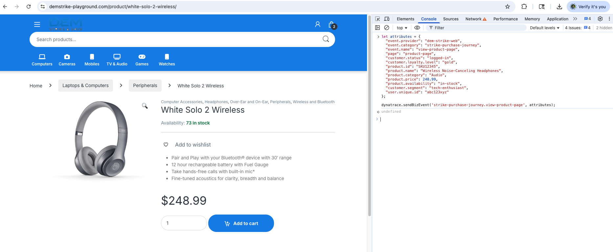
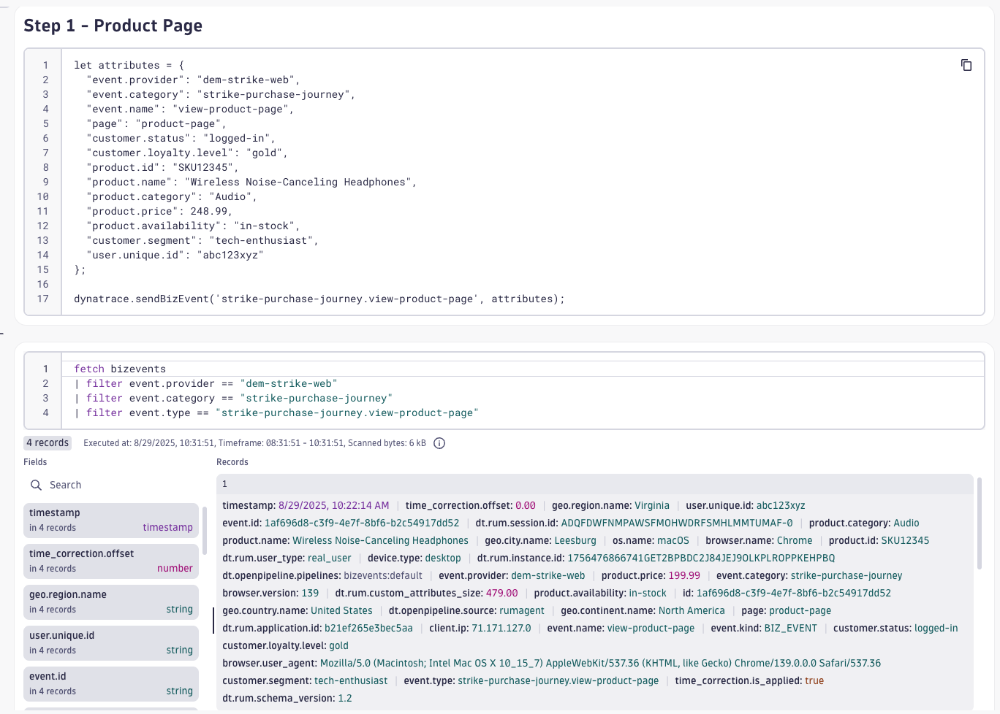
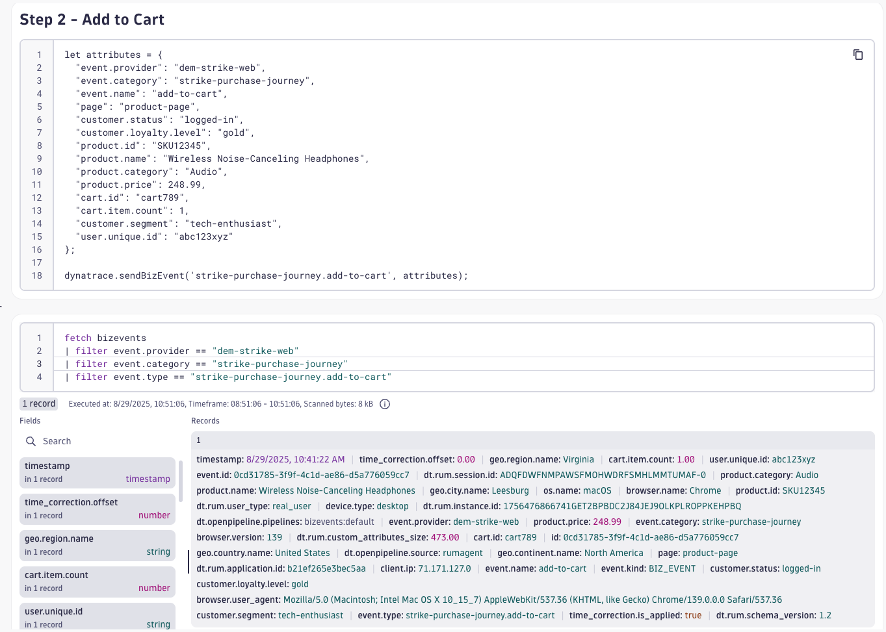
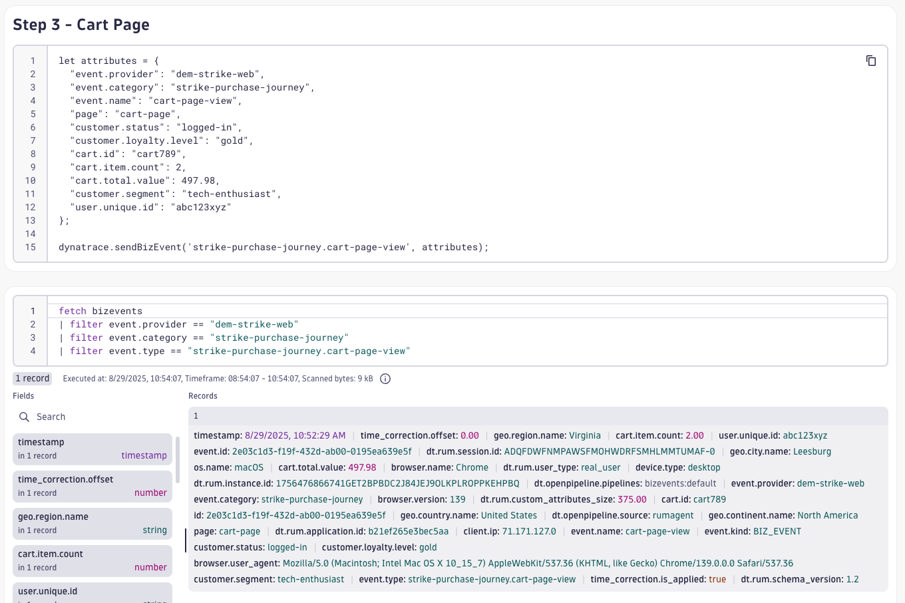
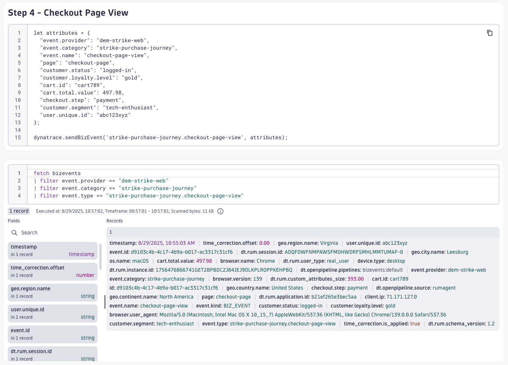
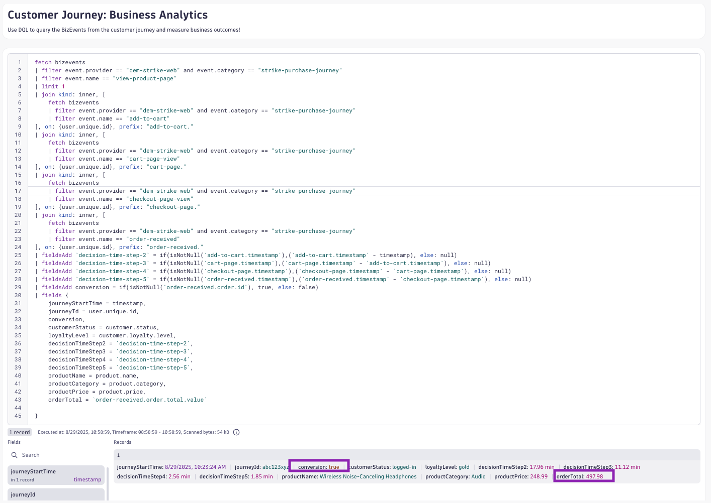

# Business Observability with RUM
--8<-- "snippets/send-bizevent/5-business-observability-rum.js"

Business events (BizEvents) are an important concept and central to Dynatrace Business Analytics. Business events generate business-grade data to enable important use cases.

Business events are available for all Dynatrace RUM technologies (web RUM, mobile RUM, and OpenKit). RUM business events can be obtained by leveraging a dedicated method of the RUM JavaScript, OneAgent for mobile, or OpenKit.

<div class="grid cards" markdown>
- [Learn More:octicons-arrow-right-24:](https://docs.dynatrace.com/docs/shortlink/ba-business-events-capturing#report-business-event-rum){target="_blank"}
</div>

## Customer Journey

Now that we understand the customer's digital experience, thanks to Real User Monitoring and Session Replay, now we want to understand the business outcomes of the customer journey.  We can accomplish this by sending BizEvents with the RUM JavaScript agent during the customer journey process.

### Prepare BizEvents

If you haven't already, download the `Customer_Journey` notebook.

[Download Workshop Notebook](https://github.com/dynatrace-wwse/enablement-browser-dem-biz-observability/blob/main/docs/assets/dynatrace/notebook/Customer_Journey.json){target=_blank}

In your Dynatrace tenant, open the **Notebooks** app.  Click `Upload` to upload the `Customer_Journey` notebook.

Locate the **Customer Journey** markdown section.  This markdown section includes the steps for purchasing products on the DEM Strike & Save webaite. We've already filled out the details for you, but you when you want to build this for your prospect or customer, you can use the following blank template to enter the customer journey steps. 

[Notebook for Tailored Demos](https://github.com/dynatrace-wwse/enablement-browser-dem-biz-observability/blob/main/docs/assets/dynatrace/notebook/Blank_Customer_Journey.json){target=_blank}

DEM Strike Purchase Journey example:

* Journey Name: `DEM Strike Purchase Journey`
* Step 1: `Product Page`
* Step 2: `Add to Cart`
* Step 3: `Cart Page`
* Step 4: `Checkout Page`
* Step 5: `Order Received`

Locate the **BizEvent Template Example** markdown section.  Here you will find the code snippet example for sending a BizEvent using the Dynatrace RUM JavaScript agent/sdk. 

Locate the **Customer Journey BizEvents** markdown section.  Below this section you'll find (10) sections; one markdown section with a code snippet and one DQL query for bizevents for each step of the customer journey. We've done the hard work for you and pre-populated all of the biz event steps and DQL queries for the DEM Strike Purchase Journey.

On another browser tab, navigate through a customer journey on the DEM Strike website and update the notebook with the attributes for each step to match your journey (page name, products, amounts, etc.) This helps us bring the demo to life and provide business context to the events.

Once you've modified the code snippets, start a new browser session and move through the customer journey.  Pause at each step of the journey and use the developer tools console to send a BizEvent with the correct payload.



After sending the BizEvent, wait a minute (usually sooner) and query the BizEvents in the notebook.

Complete step 1, send a BizEvent, and query the results.



Complete step 2, send a BizEvent, and query the results.



Complete step 3, send a BizEvent, and query the results.



Complete step 4, send a BizEvent, and query the results.



Complete step 5, send a BizEvent, and query the results.


Now that you have observability into the entire customer journey, use DQL and your creativity to analyze the business outcome of this journey.

Google Travel Track Flight example:

DQL:
```
fetch bizevents
| filter workshop == "business-observability" and event.provider == "google-travel.track-flight.v002" and event.category == "track-flight"
| filter event.type == "track-flight.travel-homepage"
| limit 1
| join kind: inner, [
    fetch bizevents
    | filter workshop == "business-observability" and event.provider == "google-travel.track-flight.v002" and event.category == "track-flight"
    | filter event.type == "track-flight.travel-homepage"
  ], on: {dt.rum.session.id}, prefix: "travel-homepage."
| join kind: inner, [
    fetch bizevents
    | filter workshop == "business-observability" and event.provider == "google-travel.track-flight.v002" and event.category == "track-flight"
    | filter event.type == "track-flight.flight-search"
  ], on: {dt.rum.session.id}, prefix: "flight-search."
| join kind: inner, [
    fetch bizevents
    | filter workshop == "business-observability" and event.provider == "google-travel.track-flight.v002" and event.category == "track-flight"
    | filter event.type == "track-flight.search-results"
  ], on: {dt.rum.session.id}, prefix: "search-results."
| join kind: inner, [
    fetch bizevents
    | filter workshop == "business-observability" and event.provider == "google-travel.track-flight.v002" and event.category == "track-flight"
    | filter event.type == "track-flight.select-flight"
  ], on: {dt.rum.session.id}, prefix: "select-flight."
| join kind: inner, [
    fetch bizevents
    | filter workshop == "business-observability" and event.provider == "google-travel.track-flight.v002" and event.category == "track-flight"
    | filter event.type == "track-flight.track-flight"
  ], on: {dt.rum.session.id}, prefix: "track-flight."
| fieldsAdd `decision-time-step-2` = if(isNotNull(`flight-search.timestamp`),(`flight-search.timestamp` - timestamp), else: null)
| fieldsAdd `decision-time-step-3` = if(isNotNull(`search-results.timestamp`),(`search-results.timestamp`- `flight-search.timestamp`), else: null)
| fieldsAdd `decision-time-step-4` = if(isNotNull(`select-flight.timestamp`),(`select-flight.timestamp` - `search-results.timestamp`), else: null)
| fieldsAdd `decision-time-step-5` = if(isNotNull(`track-flight.timestamp`),(`track-flight.timestamp` - `select-flight.timestamp`), else: null)
| fieldsAdd conversion = if(isNotNull(`track-flight.event.id`), true, else: false)
| fields {journeyStartTime = timestamp, 
          journeyId = dt.rum.session.id,
          conversion,
          userCountry = geo.country.name,
          userRegion = geo.region.name,
          userCity = geo.city.name,
          decisionTimeStep2 = `decision-time-step-2`,
          decisionTimeStep3 = `decision-time-step-3`,
          decisionTimeStep4 = `decision-time-step-4`,
          decisionTimeStep5 = `decision-time-step-5`,
          departingAirport = `track-flight.departing`,
          arrivingAirport = `track-flight.arriving`,
          price = `track-flight.price`
          }
```



Wow!  What a powerful query that let's us understand everything about the customer journey.  Business Observability focuses on the business outcomes and business KPIs needed to make data-driven decisions and when used in collaboration with DEM, ties customer experience to business outcomes.

## Continue
But what about business processes that go beyond the customer journey? What if we want to generate a ton of business data for wowing customers with insights in dashboards? In the next section we'll do just that, including exploring Business Flows, Dashboarding, and generating data.


<div class="grid cards" markdown>
- [Continue to Business Observability Automation:octicons-arrow-right-24:](6-business-observability-automation.md)
</div>
