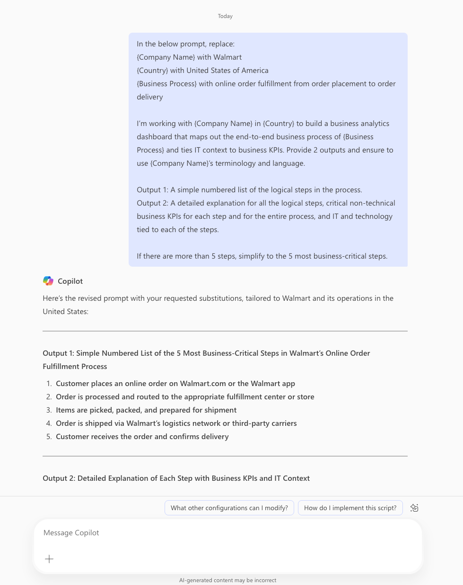
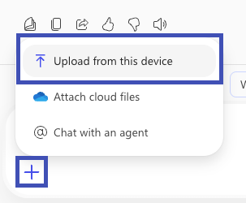
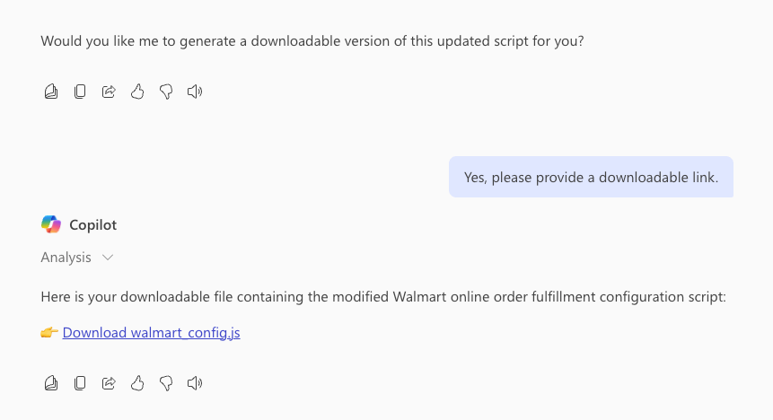
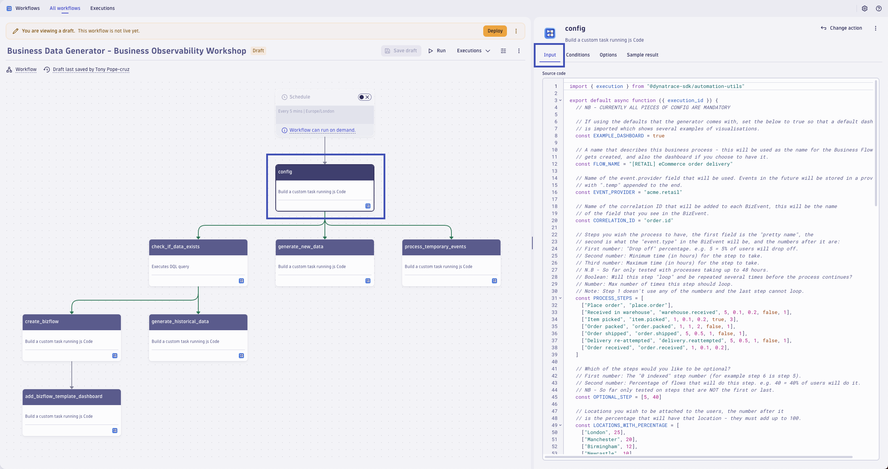
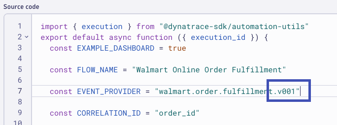
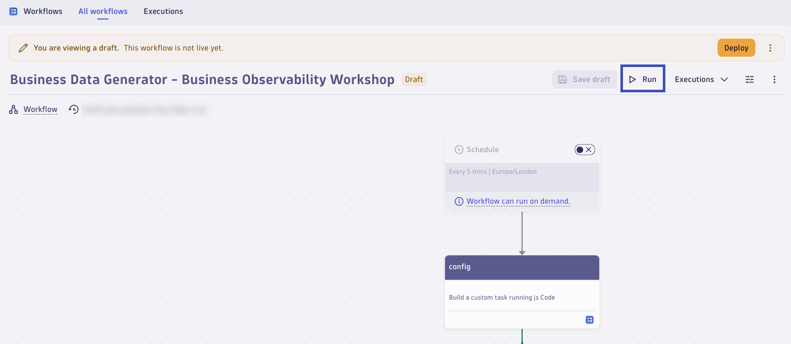
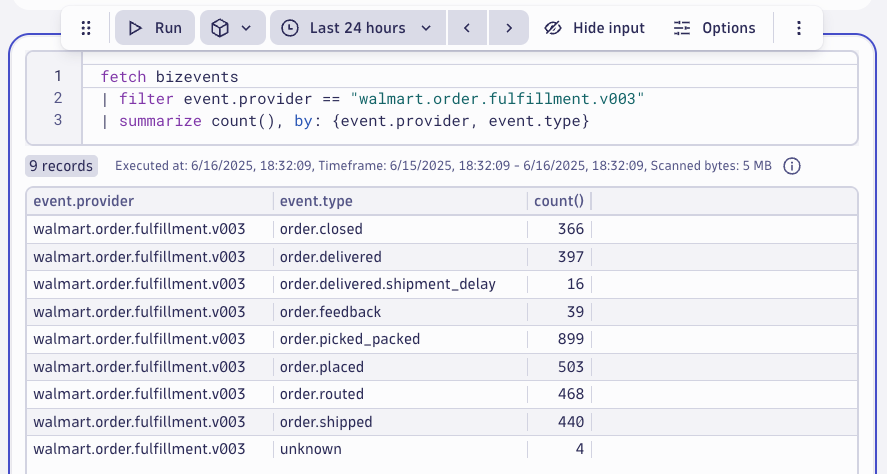
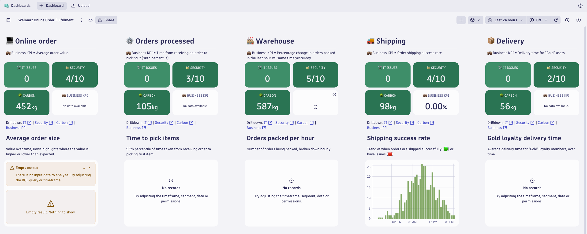

# Business Observability Automation
--8<-- "snippets/send-bizevent/6-business-observability-automation.js"

Synopsis

<div class="grid cards" markdown>
- [Learn More:octicons-arrow-right-24:](https://docs.dynatrace.com/docs/ingest-from/setup-on-k8s/deployment/k8s-log-monitoring){target="_blank"}
</div>

## Configure Workflow

TODO

### Download Workflow Assets

Download the Workflow template and configuration code snippet.

[Workflow Template](./assets/dynatrace/workflow/wf_business_data_generator_3008.json)

[Configuration Code Snippet](./assets/dynatrace/workflow/config.js)

### Update Code Snippet

Use Microsoft CoPilot to update the configuration code snippet.

<div class="grid cards" markdown>
- [Open Microsoft CoPilot:octicons-arrow-right-24:](https://copilot.cloud.microsoft/){target="_blank"}
</div>

Start a new conversation with CoPilot.  Start by providing your business journey prompt that you used in the **Getting started** section of the lab.  Allow CoPilot to generate a response.

Walmart example:
```text
In the below prompt, replace:
{Company Name} with Walmart
{Country} with United States of America
{Business Process} with online order fulfillment from order placement to order delivery

I’m working with {Company Name} in {Country} to build a business analytics dashboard that maps out the end-to-end business process of {Business Process} and ties IT context to business KPIs. Provide 2 outputs and ensure to use {Company Name}’s terminology and language.

Output 1: A simple numbered list of the logical steps in the process. 
Output 2: A detailed explanation for all the logical steps, critical non-technical business KPIs for each step and for the entire process, and IT and technology tied to each of the steps. 

If there are more than 5 steps, simplify to the 5 most business-critical steps.
```



Next, upload the configuration code snippet that you downloaded (`config.js`) by clicking the `+` button and then `Upload from this device`.



Before submitting the file, add the following to your message to give CoPilot instructions on what to do with the code snippet.

```text
Using the information provided, modify the attached script by replacing the placeholder values with the company's business process details.  Output the value of the modified script here so that I may see it.
```

Submit your prompt and allow CoPilot to generate a response.  Review the results provided and validate that it looks OK.


If the contents look OK, ask CoPilot to provide a downloadable link (it may be a suggested prompt).

```text
Yes, please provide a downloadable link.
```



Download and save the modified code snippet.

### Upload and Modify Workflow

In your Dynatrace tenant, launch the **Workflows** app.  From the `All workflows` tab, click on `Upload` and provide the Workflow template file that you downloaded (`wf_business_data_generator_3008.json`).


The Workflow will be created from the template and you'll be editing a draft.  Click on the **config** task and click on `Input` to see the source code of this task.  This is the code snippet that we need to replace with the modified code snippet that CoPilot gave us.



Copy the modified code snippet to your clipboard.  Select the entire block of code in the `Input` field, delete it, and paste in the modified code snippet.


!!! tip "Business Process Version Control"
    The results generated by the workflow are uniquely identified by the `event.provider` field.  Consider starting with a temporary value or using version control while you perfect the results.  For example, you can add `.v001` to the end of the `event.provider` field and increment the version as you make updates.
    

Once you've finished updating the `Input` of the **config** task, click `Save draft` to save your changes to the Workflow.


Run the Workflow manually by click on `Run`.



Validate that the Workflow runs successfully.  Once validated, edit the Workflow, toggle on the `Schedule` trigger so that it executes every 5 minutes.  Click on `Save` to save the changes.  Then click on `Deploy` to activate and deploy the Workflow automation.


**Troubleshooting Tips**

Gotchas: If the generator steps fail, look at the Workflow results and click on the individual step that has failed. The most common is permissions - if you are running it as yourself, you need to have `storage:events:write` permissions.  

Good to know: The generator will dump in 24 hours worth of historical data, it chooses to do that based on whether there is biz events that already exist with the `event.provider` that you have specified – otherwise it will start to generate new data. If you need fresh data, change the event.provider. You will also see events with the same event.provider but with `.temp` added – this is normal and is part of how the generator works. 

Once the generator has run, you can go into the execution results and check that the results of the “generate_historical_data” step, you should see messages similar to the below.

### Validate Results

When the Workflow runs successfully, you have (3) items to validate.

1. BizEvents for your `event.provider` value
2. Business Flow configured in the Business Flow app
3. Business Flow dashboard in the Dashboards app

**Validate BizEvents**

Validate your BizEvents by running a DQL query.  The simplest way to do this is with a **Notebook**.  Query data for the last `24 hours`.

DQL:
```sql
fetch bizevents
| filter event.provider == "your.event.provider"
| summarize count(), by: {event.provider, event.type}
```



**Validate Business Flow**

Validate your Business Flow.  Open the **Business Flow** app.  Locate the Business Flow that matches the name of your business process.  We'll explore it in more detail in an upcoming section.  For now, just make sure it was created successfully.


**Validate Dashboard**

Validate your business flow dashboard.  Open the **Dashboards** app.  Locate the dashboard that matches the name of your business process.  We'll explore it in more detail, and complete it, in an upcoming section.  For now, just make sure it was created successfully.



## Conclusion

TODO: summary