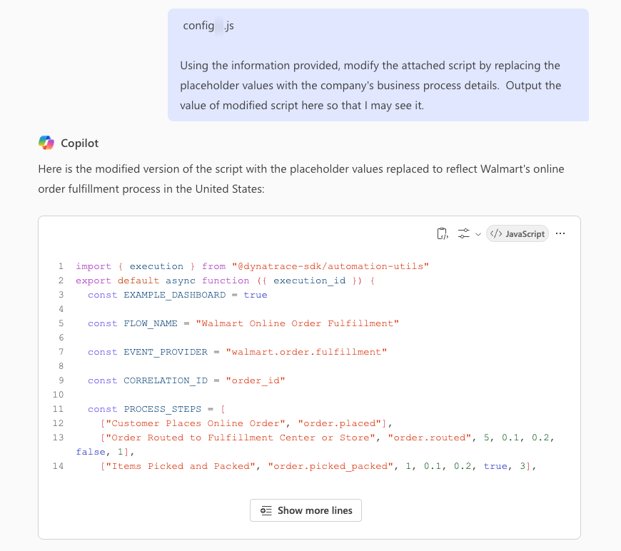
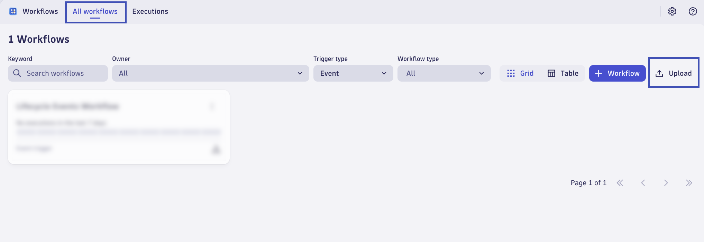
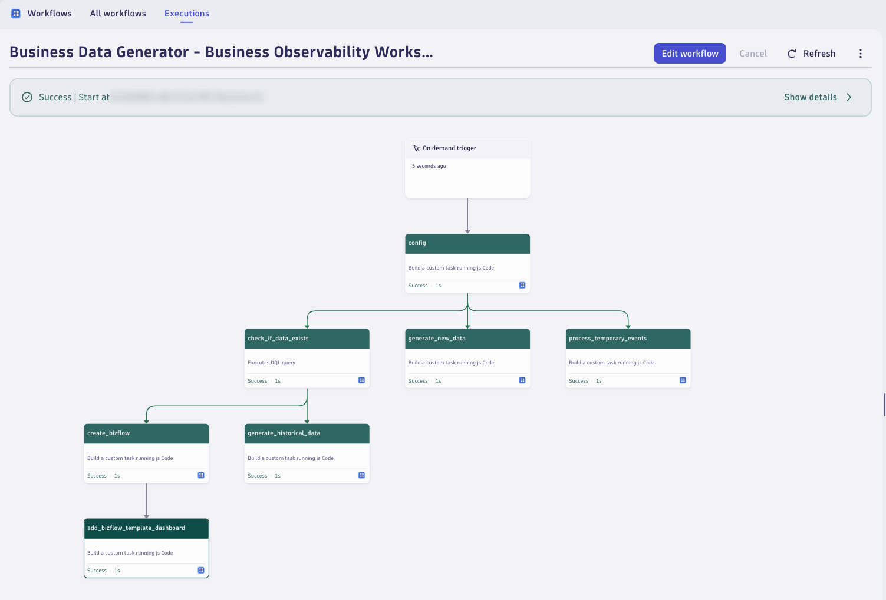
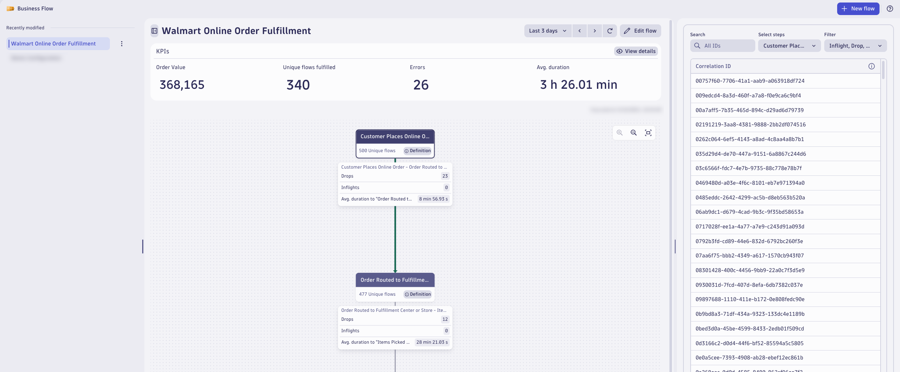
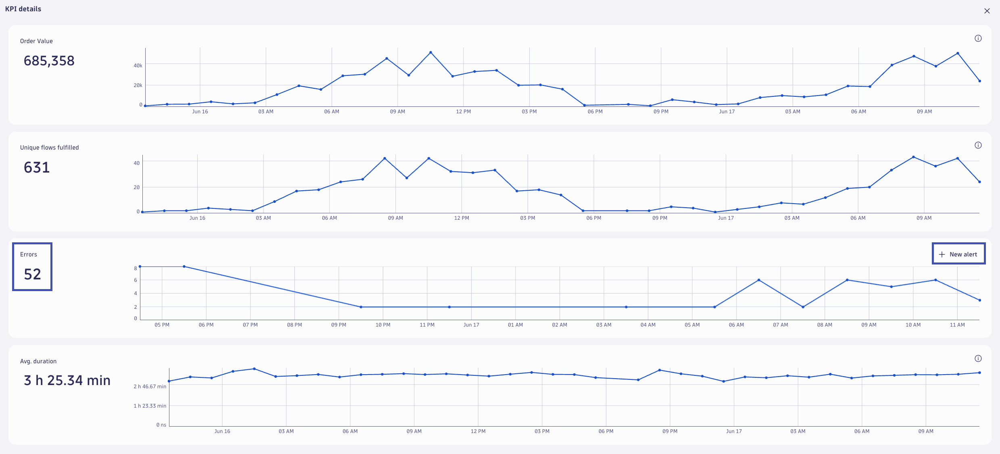
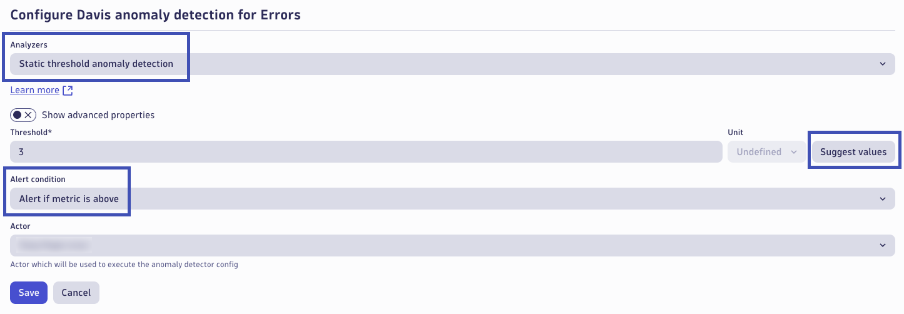
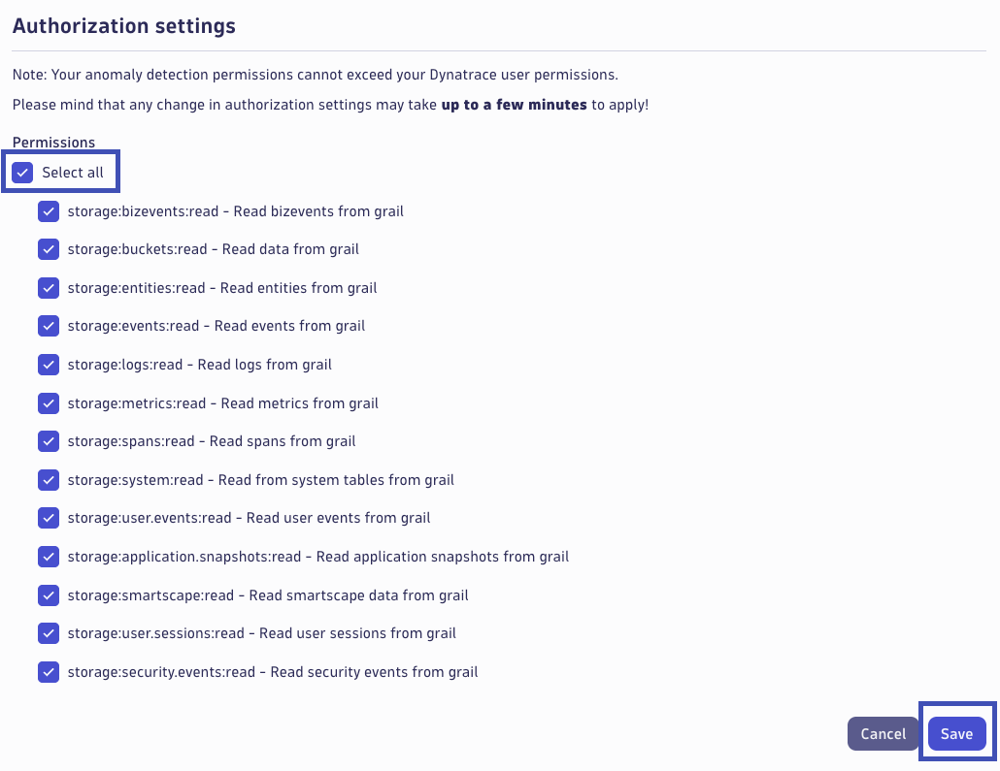
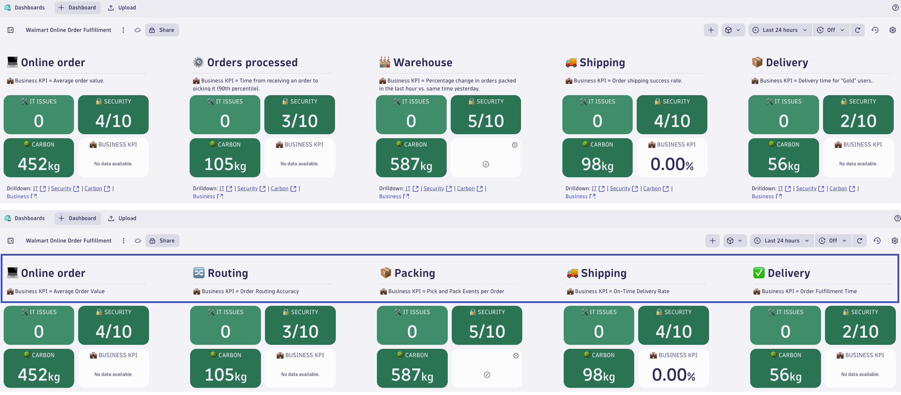

# Business Observability Automation
--8<-- "snippets/send-bizevent/6-business-observability-automation.js"

Dynatrace can be used to automate business observability use cases by orchestrating actions based on real-time business and system events. Through the Business Flow app, organizations can define and monitor key business processes—like order fulfillment or loan applications—using business events enriched with context from Dynatrace’s Smartscape topology. Workflows can automatically trigger alerts, notifications, or remediation actions when anomalies or service level objectives (SLOs) are breached, ensuring timely responses to issues that impact business outcomes. For example, a Workflow might notify business teams and open a service ticket if the average order processing time exceeds a defined threshold, helping align IT operations with business performance goals.

<div class="grid cards" markdown>
- [Learn More:octicons-arrow-right-24:](https://docs.dynatrace.com/docs/shortlink/use-case-process-monitoring){target="_blank"}
</div>

## Configure Workflow

In order to demonstrate end-to-end business process observability in this lab, we'll utilize a [Dynatrace Workflow](https://docs.dynatrace.com/docs/analyze-explore-automate/workflows/manage-workflows/workflows-upload){target=_blank} combined with Microsoft CoPilot.

### Download Workflow Assets

Download the Workflow template and configuration code snippet.

[Workflow Template](./assets/dynatrace/workflow/wf_business_data_generator_3008.json)

[Configuration Code Snippet](./assets/dynatrace/workflow/config.js)

### Update Code Snippet

Use Microsoft CoPilot to update the configuration code snippet.

<div class="grid cards" markdown>
- [Open Microsoft CoPilot:octicons-arrow-right-24:](https://copilot.cloud.microsoft/){target="_blank"}
</div>

Start a new conversation with CoPilot.  Start by providing your business journey prompt that you used in the **Getting started** section of the lab.  Allow CoPilot to generate a response.

Walmart example:
```text
In the below prompt, replace:
{Company Name} with Walmart
{Country} with United States of America
{Business Process} with online order fulfillment from order placement to order delivery

I’m working with {Company Name} in {Country} to build a business analytics dashboard that maps out the end-to-end business process of {Business Process} and ties IT context to business KPIs. Provide 2 outputs and ensure to use {Company Name}’s terminology and language.

Output 1: A simple numbered list of the logical steps in the process. 
Output 2: A detailed explanation for all the logical steps, critical non-technical business KPIs for each step and for the entire process, and IT and technology tied to each of the steps. 

If there are more than 5 steps, simplify to the 5 most business-critical steps.
```


Next, upload the configuration code snippet that you downloaded (`config.js`) by clicking the `+` button and then `Upload from this device`.


Before submitting the file, add the following to your message to give CoPilot instructions on what to do with the code snippet.

```text
Using the information provided, modify the attached script by replacing the placeholder values with the company's business process details.  Output the value of the modified script here so that I may see it.
```

Submit your prompt and allow CoPilot to generate a response.  Review the results provided and validate that it looks OK.



If the contents look OK, ask CoPilot to provide a downloadable link (it may be a suggested prompt).

```text
Yes, please provide a downloadable link.
```


Download and save the modified code snippet.

### Upload and Modify Workflow

In your Dynatrace tenant, launch the **Workflows** app.  From the `All workflows` tab, click on `Upload` and provide the Workflow template file that you downloaded (`wf_business_data_generator_3008.json`).



The Workflow will be created from the template and you'll be editing a draft.  Click on the **config** task and click on `Input` to see the source code of this task.  This is the code snippet that we need to replace with the modified code snippet that CoPilot gave us.


Copy the modified code snippet to your clipboard.  Select the entire block of code in the `Input` field, delete it, and paste in the modified code snippet.


!!! tip "Business Process Version Control"
    The results generated by the workflow are uniquely identified by the `event.provider` field.  Consider starting with a temporary value or using version control while you perfect the results.  For example, you can add `.v001` to the end of the `event.provider` field and increment the version as you make updates.
    

Once you've finished updating the `Input` of the **config** task, click `Save draft` to save your changes to the Workflow.


Run the Workflow manually by click on `Run`.


Validate that the Workflow runs successfully.  



Once validated, edit the Workflow, toggle on the `Schedule` trigger so that it executes every 5 minutes.  Click on `Save` to save the changes.  Then click on `Deploy` to activate and deploy the Workflow automation.


**Troubleshooting Tips**

Gotchas: If the generator steps fail, look at the Workflow results and click on the individual step that has failed. The most common is permissions - if you are running it as yourself, you need to have `storage:events:write` permissions.  

Good to know: The generator will dump in 24 hours worth of historical data, it chooses to do that based on whether there is biz events that already exist with the `event.provider` that you have specified – otherwise it will start to generate new data. If you need fresh data, change the event.provider. You will also see events with the same event.provider but with `.temp` added – this is normal and is part of how the generator works. 

Once the generator has run, you can go into the execution results and check that the results of the “generate_historical_data” step.

### Validate Results

When the Workflow runs successfully, you have (3) items to validate.

1. BizEvents for your `event.provider` value
2. Business Flow configured in the Business Flow app
3. Business Flow dashboard in the Dashboards app

**Validate BizEvents**

Validate your BizEvents by running a DQL query.  The simplest way to do this is with a **Notebook**.  Query data for the last `24 hours`.

DQL:
```sql
fetch bizevents
| filter event.provider == "your.event.provider"
| summarize count(), by: {event.provider, event.type}
```


**Validate Business Flow**

Validate your Business Flow.  Open the **Business Flow** app.  Locate the Business Flow that matches the name of your business process.  We'll explore it in more detail in an upcoming section.  For now, just make sure it was created successfully.



**Validate Dashboard**

Validate your business flow dashboard.  Open the **Dashboards** app.  Locate the dashboard that matches the name of your business process.  We'll explore it in more detail, and complete it, in an upcoming section.  For now, just make sure it was created successfully.


## Analyze Events

TODO

## Analyze Business Flow

Use Business Flow to monitor and optimize business processes. Gain real-time visibility into key performance indicators and detailed analytics to improve customer satisfaction, increase efficiency, and reduce cost.

With Business Flow, you can:

- Define the sequence of important process steps or process milestones, including branches and loops
- Define business exceptions to report at each step
- Analyze individual end-to-end process flows
- Detect dropped or stalled process flows
- Track process KPIs, including end-to-end process timing and inter-step delays

Review the **[Business Flow Terminology](https://docs.dynatrace.com/docs/shortlink/business-flow-reported-kpis#terminology){target=_blank}** to better understand the results presented to you by Dynatrace.

Open the **Business Flow** app.  Locate the Business Flow that matches the name of your business process.

Start by reviewing the entire end-to-end flow from top to bottom.  Identify the different steps in the business process, the data points automatically captured by Dynatrace, and how each unique flow is mapped out for you.


Next, investigate a single unique flow that dropped during the fourth step.  Click on the fourth step of the business flow.  From the unique flows by correlation id table on the right, change the `Filter` option to **Drop**.  Now, select the first correlation id.


The BizEvents matching this flow for this specific correlation id are shown.  You can see the timestamp for each step and any additional attributes that were captured in the BizEvent.


!!! tip "BizEvents in Context"
    In a real scenario, the BizEvent should be captured with additional context that links the business grade data to underlying applications and infrastructure that makes the business step possible.  Typically this is a linked infrastructure entity (host, container, process, service, etc.), distributed trace data, and logs.  You can drill down into Notebooks to perform deeper analysis on these unique flows that experienced undesired results.
    

Let's investigate a single unique flow that experienced a business exception that prevented our desired business outcome.  Click on the step that has business exceptions detected (most likely your fifth step).  From the unique flows by correlation id table on the right, change the `Filter` option to **With business exception**.  Now, select the first correlation id.


The BizEvents matching this flow for this specific correlation id are shown.  You can see the timestamp for each and any additional attributes that were captured in the BizEvent.  In real scenario, you could drill down into the step with the business exception and analyze the infrastructure, trace, and log details to understand exactly why this problem occurred.


## Business Flow Alerting

The Business Flow **Business Flow KPIs** visible at the top provide four key performance indicators, calculated as a change in percent against the previous monitoring timeframe:

- Business performance indicator (by default, revenue)
- Fulfillment or conversion of unique flows in the business process
- Errors and business exceptions in the monitored flows
- Average flow duration (the time from start to end of a business process)

### Configure KPI Alert

Depending on the average flow duration, the Davis AI engine can be used to automatically detect anomalies with your business KPI.  Let's configure Davis to detect anomalies for the **Errors** KPI.  View the KPIs for your flow and click on `New Alert` for the `Errors` KPI.



The first step is to identify which Analyzer and corresponding anomaly detection method you want to use.  Select `Static threshold anomaly detection`.

!!! tip "Davis Anomaly Detector Analyzers"
    Dynatrace offers (3) [different analyzer options](https://docs.dynatrace.com/docs/discover-dynatrace/platform/davis-ai/anomaly-detection#concepts){target=_blank} in this context.

    * Static thresholds: A static threshold represents a hard limit that a metric should not violate. Because static thresholds don't change over time, they are an important monitoring tool for defining critical boundaries of normal operation.
    * Auto-adaptive thresholds: Auto-adaptive thresholds are a dynamic approach to baselining where the reference value for detecting anomalies changes over time. The main advantage over a static threshold is that the reference value dynamically adapts over time, and you don't have to know the threshold upfront.
    * Seasonal baseline thresholds: A seasonal baseline represents a dynamic approach to baselining where the systems have distinct seasonality patterns. An example of a seasonal pattern is a metric that rises during business hours and lies low outside of them.

For the `Threshold`, click on `Suggest values` to have Dynatrace pick a threshold based on observed historical data.  Set the `Alert condition` to `Alert if metric is above` because we want to alert on increased business exception errors.  The `Actor` should be left at your user account.  Davis will query and detect anomalies using the permissions of your user account.  Click `Save` to create the alert.



**Authorize Davis Anomaly Detectors**

You need to authorize Davis Anomaly Detection to execute queries on your behalf.  If you haven't done that already, then open the **Davis Anomaly Detection** app.  In the top right corner, click on the gear icon, and click `Authorization Settings`.


Click on `Select all` to grant Davis Anomaly Detection access to query all data types on your behalf.  Note: if your user account doesn't have access to query a certain data type, then of course Davis won't be able to query it on your behalf.



After some period of time, the anomaly detector should evaluate successfully.  If not, click the status indicator and address the underlying errors.


### Configure Alerting Workflow

TODO

## Business Observability Dashboard

Combining business-grade data with observability data in a single dashboard is essential for aligning technical performance with business outcomes. This integration allows teams to quickly understand how system behavior — like latency or errors - impacts key metrics such as revenue, user engagement, or transaction volume. It also helps prioritize incidents based on business impact and supports more informed, cross-functional decision-making. Ultimately, it bridges the gap between technical operations and strategic goals, enabling both proactive optimization and clearer executive visibility.

Our Workflow has automatically added a dashboard we can use as a template to start understanding the health of our end-to-end business process in context of the technology that powers it.

**Goals:**
* Modify dashboard to show the steps of our business process (5 steps)
* Update the first column with the first step, focusing on the customer journey outcome and the business revenue KPI
* Update the fourth column with the fourth step, focusing on exceptions and errors in the business journey
* Update the fifth column with the fifth step, focusing on business journey conversions and measuring success

!!! tip "Dashboard Completion"
    Use the concepts learned in this lab and the information provided by Microsoft CoPilot to complete the dashboard, specifically the remaining 2 columns and business process steps, on your own.

### Align Business Process



### Customer Journey Outcome

We will be editing the tiles for **Business KPI**, **Average order size**, and **Orders by loyalty tier** to reflect data and context for our business process step 1 representing the customer journey outcome.

Begin by updating the Business KPI query.  Use the information from Microsoft CoPilot to align on the KPI and modify the query to use the revenue attribute from the first business process step.


Next, update the KPI chart query.  Use a query very similar to the previous one (Business KPI), but change the visualization so that it's not just a single value.  A timeseries chart of the KPI is recommended.


Finally, update the auxillary KPI query.  Choose a query that uses the information from the first business process.  For example, use the customer segmentation type to create a pie chart or categorical chart with multiple dimensions.


### Business Exceptions

We will be editing the tiles for **Business KPI**, **Shipping success rate**, and **Vouchers Offered** to reflect data and context for our business process step 4 focusing on business exceptions.

Begin by updating the Business KPI query.  Use the information from Microsoft CoPilot to align on the KPI and modify the query to use the business exception events related to the fourth business process step.


Next, update the KPI chart query.  Use a query very similar to the previous one (Business KPI), but change the visualization so that it's not just a single value.  A timeseries chart of the KPI is recommended.


Finally, update the auxillary KPI query.  Choose a query that uses information from business exception events.  For example, use the first step's revenue attribute combined with the business exception.


### Business Journey Conversions

We will be editing the tiles for **Business KPI**, **Gold loyalty delivery time**, and **End-to-end order time** to reflect data and context for our business process step 4 focusing on business exceptions.

Begin by updating the Business KPI query.  Use the information from Microsoft CoPilot to align on the KPI and modify the query to use the events from the final business process step.  You may need to include events from previous business steps to calculate the metric.


Next, update the KPI chart query.  Use a query very similar to the previous one (Business KPI), but change the visualization so that it's not just a single value.  A timeseries chart of the KPI is recommended.


Finally, update the auxillary KPI query.  Choose a query that uses information from the events from the final business process step.  Consider using the optional step event data as well.


### Dashboard Completion

Use the concepts learned in this lab and the information provided by Microsoft CoPilot to complete the dashboard, specifically the remaining 2 columns and business process steps, on your own.

It's highly recommended to be creative and manipulate the data to match the information provided by Microsoft CoPilot.  However, if you need some additional guidance on completing the business KPIs and writing the DQL queries, here are some tips:

Typically the KPI is one of the types below: 
* Success rate of the step (typically one where you’ve defined an error) 
* The time taken since a previous step
* Comparison to a historical value (e.g. orders packed per hour now vs yesterday) 

Choose one of these data KPI types and using the template DQL – populate the “Business KPI” tile, and also the description above the tiles. 

**Time between two steps**

``` 
fetch bizevents 
| filter event.provider == "<Your event provider>" 
| filter event.type == "<First event type>" or event.type == "<Second event type>" 
| summarize firstTime = takeMin(timestamp), secondTime = takeMax(timestamp), by:{<Correlation ID> } 
| filterOut isNull(firstTime) or isNull(secondTime) 
| fieldsAdd duration = secondTime - firstTime 
| summarize averageTime = avg(duration)
```

**Success rate of step**

``` 
fetch bizevents 
| filter event.provider == "<Your event provider>" 
| filter startsWith(event.type, "<event.type of your step that errors>") 
| summarize total = count(), success = countIf(event.type == "<event.type of your step that errors>") 
| fieldsAdd percentage = toDouble(success) / toDouble(total) * 100 
``` 

**Comparison to previous time**

```
fetch bizevents, from: -1h
| filter event.provider == "<Your event provider>" and event.type == "<event.type of step in question>" 
| summarize valueNow= count(), by:{event.type} 
| lookup [fetch bizevents, from: -24h, to:-23h | filter event.provider == "<Your event provider>" and event.type == "<event.type of step in question>" | summarize previousValue = count(), by:{event.type} ], sourceField:event.type, lookupField:event.type 
| fieldsAdd percentageChange = ((toDouble(lookup.previousValue) - toDouble(valueNow)) / toDouble(valueNow)) * 100
```
 
Once this is done, populate the first “graph” underneath the tiles at the top. Typically this first graph will be related in some way to the tile at the top. For example: 

If it’s success rate: Line graph the success rate over time + A donut graph of “failure” totals in different segments. 

If it’s a time KPI, do something like: The time per segment in a line graph + The time per location in a categorical graph. 

If it’s a comparison KPI: A line chart showing the value over time (possibly using thresholds to add some color).

Next up is the graph at the bottom, this will be related to the step in some way but doesn’t have to be directly tied to the KPI. Some of the popular choices are: 

Lost “flows” – for example mortgage applications that haven’t been touched in X hours. Related to the above, what’s the “revenue” impact of lost flows. Flows split by segment.

**Lost items**

``` 
fetch bizevents 
| filter event.provider == "<Your event provider
| filter event.type == "<First event type>" or event.type == "<Second event type>"
| summarize firstCount = countIf(event.type == "<First event type>"), secondCount = countIf(event.type == "<Second event provider>"),firstTime = takeFirst(timestamp), by:{<Correlation ID> }
| fieldsAdd timeSinceFirstStep = (now() - firstTime)
| filter secondCount == 0 and timeSinceFirstStep > toDuration(7200000000000) //Time in nanoseconds
| makeTimeseries `Lost flows` = count(), time: firstTime, bins:50
| fieldsAdd totalLostFlows = arraySum(`Lost flows`)
```

## Conclusion

TODO: summary